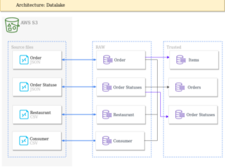

# Ifood Data Architect Test

This project process semi-structured data and build a datalake that provides efficient storage and performance. The datalake is organized in the following 2 layers:
- *raw layer*: datasets must have the same schema as the source, but support fast structured data reading
- *trusted layer*: Datamarts as required by the analysis team

The Datamarts required in trusted layer should be built as the following rules:
- *Order dataset*: one line per order with all data from order, consumer, restaurant and the LAST status from order statuses dataset. To help analysis, it would be a nice to have: data partitioned on the restaurant LOCAL date.
- *Order Items dataset*: easy to read dataset with one-to-many relationship with Order dataset. Must contain all data from order items column.
- *Order statuses*: Dataset containing one line per order with the timestamp for each
registered event: CONCLUDED, REGISTERED, CANCELLED, PLACED.

For the trusted layer, anonymize any sensitive data.

At the end of each ETL, use any appropriated methods to validate your data. Read
performance, watch out for small files and skewed data.

**Non functional requirements**

- Data volume increases each day.
- All ETLs must be built to be scalable.
